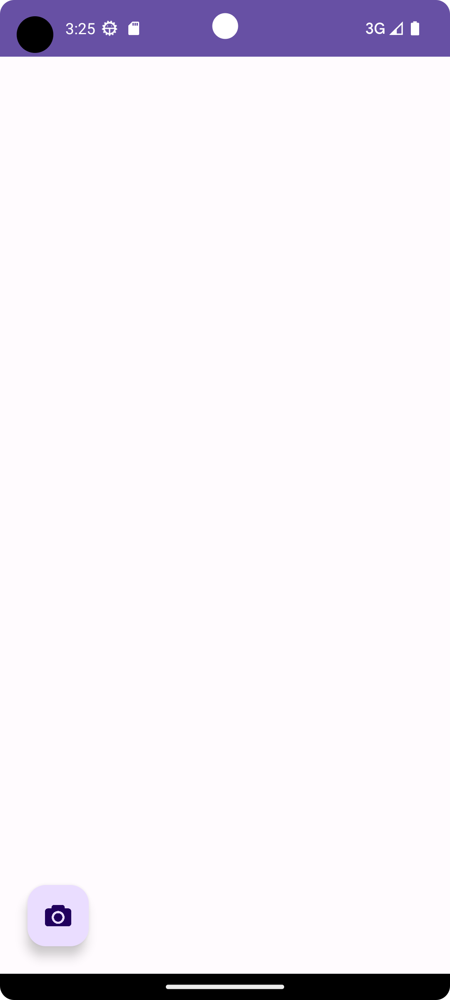
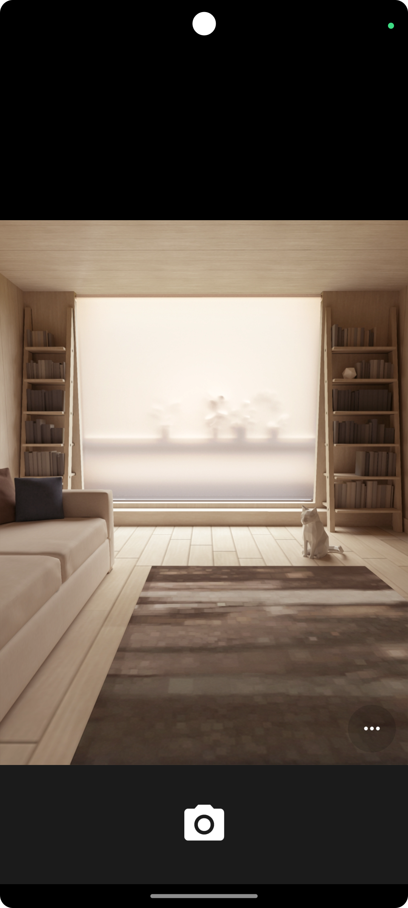
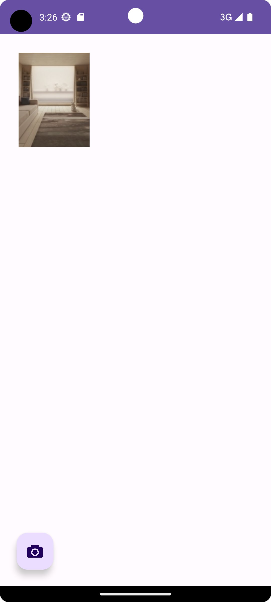
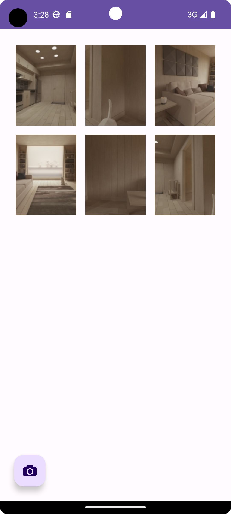
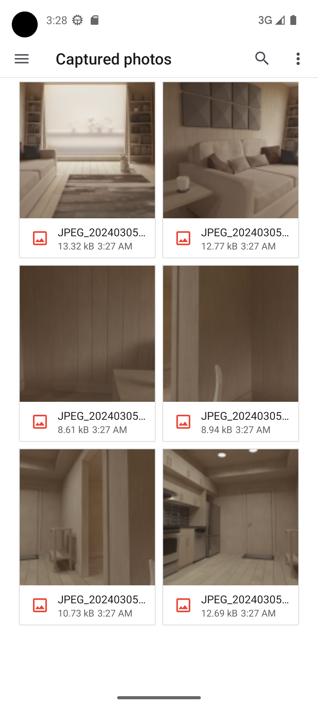
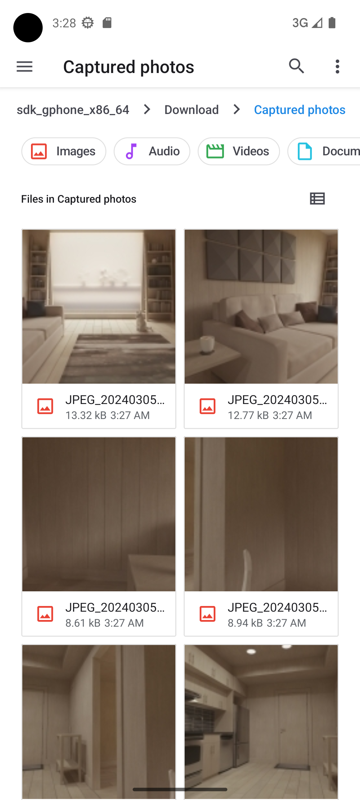
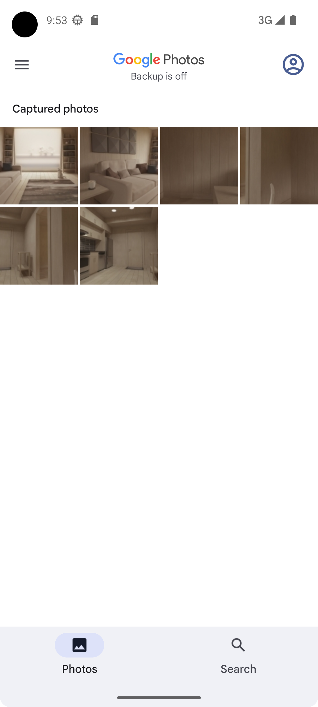

# PhotoCapture App

This is a simple Android application written in Kotlin that allows users to capture photos, save them in a specified directory within the Downloads folder, and display the captured images on the main screen without the require permitions.

## Features

- **Capture Photo:** Press the "Capture Photo" button on the home screen to access the camera and take a photo.
- **Save Photo:** The captured photo is automatically saved in the "Downloads/PhotoCapture" directory.
- **View Captured Photos:** The gallery displays a list of all the captured photos with a thumbnail and the date/time of capture.

## Installation

[Download APK](https://raw.githubusercontent.com/vakiliali79/Camera/master/Camera.apk)


## Screenshots:

- **Screenshot 1**:

  

- **Screenshot 2**:

  

- **Screenshot 3**:

  

- **Screenshot 4**:

  

- **Screenshot 5**:

  

- **Screenshot 6**:

  

  - **Screenshot 7**:

  


## Usage


1. Clone the repository:

```bash
git clone https://github.com/vakiliali79/Camera.git
```

2. Open the project in Android Studio.

3. Run the app on an emulator or a physical device.

4. Press the "Capture Photo" button to take a photo.

5. Captured photos will be saved in the "Downloads/PhotoCapture" directory.

## Permissions

This app does not request camera or storage permissions explicitly, as it aims to demonstrate capturing photos without permission requests. Note that this approach may not be suitable for production applications.
